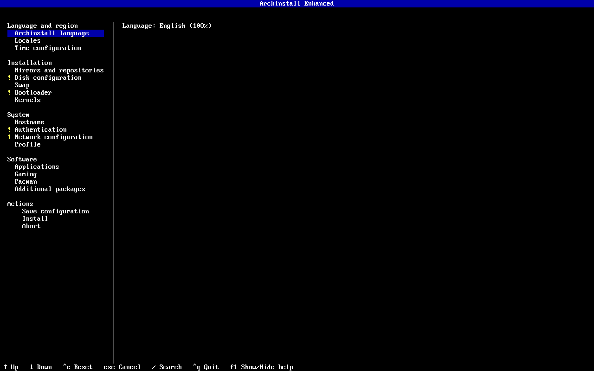
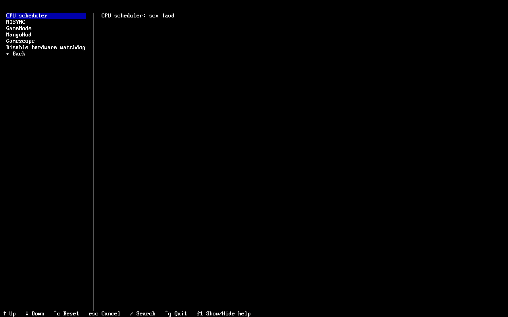
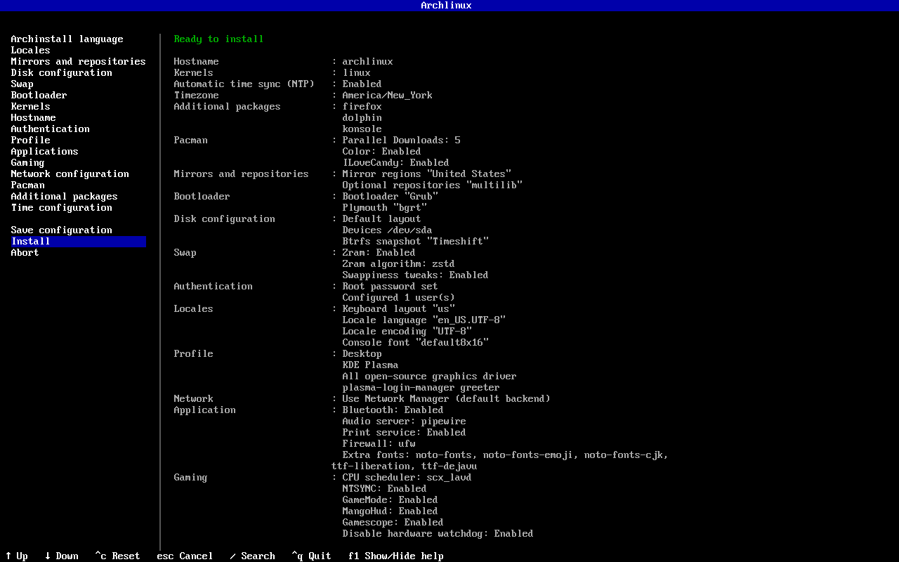

# Archinstall Enhanced


An enhanced fork of [Archinstall](https://github.com/archlinux/archinstall) focused on making Arch Linux desktop and gaming installations more complete out of the box.

This fork adds more gaming, performance, desktop, and system configuration options directly to the Archinstall guided installer. The goal is to make it easier to install a well-configured Arch Linux system without having to manually set up many of these features after the first boot.

Changes included in this fork are intended to be stable, properly implemented, and backed by official documentation, upstream behavior, or established community recommendations whenever possible. Experimental features are clearly identified and remain optional.

This project is not intended to throw random performance tweaks into Archinstall. Features are added because they provide a useful configuration option, solve a real problem, improve the installation experience, or make common desktop and gaming setups easier to configure.

> [!IMPORTANT]
> This is an independent fork of Archinstall. It is not the official Arch Linux installer.
>
> Installing the `archinstall` package from the Arch Linux repositories will install the official upstream version, not the changes included in this repository.

> [!NOTE]
> Archinstall Enhanced intentionally provides a broader desktop baseline than upstream Archinstall. A desktop installation may therefore contain more packages and use somewhat more disk space. The additional packages cover common codecs, hardware support, desktop integration, and diagnostic tools; workload-specific and experimental components remain optional so users can keep the system as lean as they prefer.

## Screenshots

<p align="center">
  
</p>

<p align="center">
  
</p>

<p align="center">
  
</p>

## Why this fork exists

Archinstall provides a very good base for installing Arch Linux, but it intentionally keeps the default installer fairly general.

For desktop and gaming systems, there are still a number of useful packages, services, and configuration options that users commonly set up manually after installation.

Archinstall Enhanced tries to bring more of that setup into the installer itself while keeping the familiar Archinstall workflow.

The main goals of the project are:

- provide useful desktop and gaming options during installation
- make commonly used system configuration easier to set up
- provide optional performance tuning without forcing it on the user
- keep experimental features clearly separated from stable features
- use documented and maintainable configuration methods
- preserve normal Arch Linux behavior whenever possible
- remain close enough to upstream Archinstall that upstream changes can still be incorporated cleanly

Most additional features are optional. Users can decide how much or how little they want the installer to configure.

The default desktop additions are limited to broadly useful integration and verification packages. Features that are hardware-specific, workload-specific, experimental, or likely to consume significant storage are presented as explicit choices instead of being installed unconditionally.

## Main differences from upstream

### Gaming and performance

The guided installer includes a **Gaming** section with optional support for:

- sched-ext CPU schedulers
- `scx_loader`
- Gaming mode scheduler configuration
- NTSYNC module autoloading through `ntsync-autoload`
- GameMode
- MangoHud
- Gamescope
- an optional larger Mesa and NVIDIA shader cache based on CachyOS guidance
- an optional SteamOS-style `vm.max_map_count` increase with a compatibility warning
- 32-bit OpenGL and Vulkan libraries matched to the selected graphics driver
- an option to prevent DualShock 4 and DualSense touchpads from controlling the desktop pointer
- optional AMD and Intel hardware watchdog configuration for advanced users

Stable and experimental sched-ext schedulers are separated so users can tell which options are considered more mature.

NTSYNC remains optional, but is no longer labeled experimental: current official Arch kernels provide the module and current Wine and Proton versions use it automatically when available.

Multilib is enabled automatically only when a selected feature requires a 32-bit package such as:

- `lib32-gamemode`
- `lib32-mangohud`

If none of the selected options require Multilib, the installer does not enable it unnecessarily.

When 32-bit graphics support is enabled, the installer selects the appropriate Mesa, Vulkan, or NVIDIA Multilib packages for the graphics driver chosen in the desktop profile. These libraries are commonly needed by Steam, Wine, Proton, and older games.

The PlayStation controller option installs documented libinput udev rules for DualShock 4 and DualSense touchpads. It prevents the touchpads from moving the desktop pointer without disabling direct controller access in games.

The shader-cache option writes a system-wide configuration with a 12 GB limit for both Mesa and NVIDIA. A larger cache can reduce shader recompilation and related stutter, but it can also use more disk space, so it remains optional.

The `vm.max_map_count` option uses the SteamOS value. The installer explains that the normal Arch Linux default is sufficient for most users and warns about the older core-dump tools that the Arch Wiki identifies as potentially incompatible with unusually high values.

### Zram

Swap-on-zram can be configured directly through the installer.

When zram is enabled, the installer applies the ArchWiki memory-management settings that prioritize compressed RAM over slower disk-backed pages and reduce swap read-ahead. These values are treated as part of the zram setup rather than exposed as a separate toggle.

The installer configures zram to use up to the smaller of physical RAM or 8 GiB. The menu shows only compressor names. Behind the scenes, tunable compressors use their balanced kernel defaults: `zstd` level 3, `lz4` acceleration level 1, and `lz4hc` level 9. `lzo-rle`, `lzo`, and `842` do not support levels and are left unparameterized. Swap priority and other device settings continue to use `zram-generator` defaults. Idle recompression is not enabled automatically because it requires a separate userspace schedule to mark and process cold pages reliably.

The selected compressor is saved with the rest of the Archinstall configuration. Older saved configurations containing a separate swappiness-tweak field remain loadable; that legacy field is ignored because the documented values are now part of every enabled zram setup.

### Btrfs

Automatically generated Btrfs layouts use transparent Zstandard compression by default. The installer still allows compression to be disabled or Copy-on-Write to be disabled when a workload requires different behavior.

### Desktop configuration

Archinstall Enhanced can install and configure additional packages when the user selects features that need them.

Examples include:

- `rtkit` with PipeWire for real-time audio scheduling
- packaged PipeWire user services and socket activation without modifying user home directories
- a complete GStreamer codec set, FFmpeg, and the VA-API GStreamer plugin
- XDG desktop portal support, including a GTK fallback for graphical profiles and the wlroots screen-sharing backend for Sway
- Avahi for network service discovery
- `nss-mdns` for `.local` hostname resolution
- network printer discovery
- print service configuration
- Bluetooth configuration
- optional firmware updates through `fwupd`, including periodic metadata refreshes
- power management options
- firewall configuration
- additional font packages

Desktop installations also include a compact baseline of command-line documentation, archive, transfer, synchronization, and development utilities. This includes tools such as `man-db`, `man-pages`, `curl`, `git`, `rsync`, `unzip`, `7zip`, and shell completion.

The installer does not automatically install every optional component.

If a feature is not selected, the packages and services associated with that feature are left out.

OpenCL compute support is available as a separate opt-in setting beside the graphics-driver selection. Mesa Rusticl is used for AMD and Nouveau, Intel Compute Runtime is used for Intel, and the NVIDIA OpenCL runtime is used with NVIDIA's open kernel module. Diagnostic tools and the vendor-neutral ICD loader are installed with the runtime.

Selecting a graphics driver also installs `mesa-utils`, `vulkan-tools`, and `libva-utils`. These provide the ArchWiki-documented `eglinfo`/`glxinfo`, `vulkaninfo`, and `vainfo` checks for direct rendering, OpenGL/EGL, Vulkan, and hardware video acceleration after the first boot.

Graphics packages follow the selected hardware profile. Modern Xorg modesetting is used for Nouveau instead of installing the legacy `xf86-video-nouveau` DDX, which current ArchWiki guidance no longer recommends. Optional 32-bit and OpenCL runtimes remain separate choices.

Desktop profiles enable Fontconfig's maintained `70-no-bitmaps-except-emoji.conf` preset to avoid poor bitmap fallbacks while preserving bitmap emoji. Font families remain user-selectable through the existing Additional fonts menu; the installer does not force a subpixel layout or install font families automatically.

The optional multimedia-codec setting installs the GStreamer base, good, bad, and ugly plugin families, `gst-libav`, `gst-plugin-va`, and FFmpeg. PipeWire installations continue to include `gst-plugin-pipewire` for PipeWire integration.

When the installer detects that it is running specifically inside a VirtualBox guest, it installs `virtualbox-guest-utils`, enables `vboxservice.service`, and adds configured users to the `vboxsf` group for shared-folder access. This detection does not run for KVM, QEMU, VMware, or physical installations.

### Networking and DNS caching

NetworkManager installations can use a local DNS cache. The interactive installer recommends `systemd-resolved` by default while retaining the other choices:

- `systemd-resolved` uses its `127.0.0.53` local stub, enables caching, and receives per-connection DNS information from NetworkManager.
- `dnsmasq` runs as NetworkManager's local caching resolver with a larger cache.
- DNS caching can be left disabled to retain NetworkManager's default resolver behavior.

A local DNS cache can make repeated lookups, application connections, and the startup of downloads feel faster. It does not increase sustained download bandwidth.

Printer discovery adapts to the selected resolver. With `systemd-resolved`, Avahi handles printer advertisement while resolved handles and caches mDNS lookups without installing a competing NSS mDNS resolver. The default and `dnsmasq` paths continue to use `nss-mdns` for `.local` name resolution.

### Pacman configuration

Additional Pacman settings are exposed through the guided installer.

Current options include:

- Parallel Downloads without requiring `--advanced`
- Pacman color output
- `ILoveCandy`

Desktop profiles install `pacman-contrib` and enable the weekly `paccache.timer`. The standard paccache policy retains the three newest package versions, preserving downgrade options while preventing the package cache from growing indefinitely.

These settings are also saved and restored through the normal Archinstall configuration system.

### Installer improvements

The fork includes several smaller improvements to the guided installation experience.

These include:

- grouped main and Gaming menus for a clearer installation flow
- combined timezone, automatic NTP, and hardware-clock configuration
- defaulting the UTC hardware-clock update off when a Windows Boot Manager EFI entry is detected, while keeping the choice user-overridable
- enabling `systemd-timesyncd.service` and `systemd-time-wait-sync.service` when NTP is selected
- consistent `Setting: Value` configuration summaries
- consistent `Enabled` and `Disabled` status formatting
- every configuration section shows a summary on the right side even before it has been set, rather than only after
- selection prompts always start with the cursor on the first option, so lists behave the same way everywhere
- confirmation prompts consistently list `No` before `Yes` with `No` preselected, including the prompts that can erase a disk
- configuration persistence for the additional menus introduced by the fork
- proper console font restoration when changing installer languages
- improved handling of HiDPI console font configurations
- better network printer and mDNS configuration handling
- automatic VirtualBox guest integration when VirtualBox is positively detected
- clearer descriptions for sched-ext, NTSYNC, GameMode, MangoHud, Gamescope, zram, Pacman, watchdog, and networking options

The goal of these changes is to make the installer easier to use without changing the overall Archinstall workflow.

Because this fork targets a narrower set of desktop and gaming use cases, it has room to spend extra attention on interaction consistency across the menus it adds and the ones it touches. The aim is for every prompt to behave in a predictable way, so that once a user learns how one menu works they already know how the rest work. This is a set of small refinements layered on top of the interaction model that Archinstall already provides.

## Stability and implementation

Archinstall Enhanced is meant to provide useful additions without sacrificing the reliability expected from an operating system installer.

Changes should be based on proper documentation and tested behavior instead of being added simply because a tweak is popular.

When applicable, implementation decisions are based on sources such as:

- [Arch Linux documentation](https://archlinux.org/)
- the [ArchWiki](https://wiki.archlinux.org/)
- the [CachyOS Wiki](https://wiki.cachyos.org/)
- [EndeavourOS Discovery](https://discovery.endeavouros.com/)
- the [Manjaro Wiki](https://wiki.manjaro.org/)
- Linux kernel documentation
- upstream project documentation
- upstream Archinstall behavior
- established community recommendations
- testing and regression coverage

Arch Linux and upstream project documentation take priority for package names and configuration behavior. Other Arch-based distributions are useful cross-checks for mature desktop integration and opt-in performance features, but distribution-specific tuning is not copied without checking that it is appropriate for a general Arch installation.

Some defaults deliberately incorporate proven choices from other Linux distributions:

- The zram size, `min(ram, 8192)`, follows [Fedora's system-wide zram configuration](https://fedoraproject.org/wiki/Changes/Scale_ZRAM_to_full_memory_size): a virtual device equal to RAM on smaller systems and capped at 8 GiB.
- The zram virtual-memory settings (`vm.swappiness=180`, `vm.watermark_boost_factor=0`, `vm.watermark_scale_factor=125`, and `vm.page-cluster=0`) follow the [ArchWiki zram guidance](https://wiki.archlinux.org/title/Zram), which documents their origin in Pop!_OS and supporting Fedora community testing.
- The optional `vm.max_map_count` value follows the SteamOS gaming-oriented default documented in the [ArchWiki gaming guidance](https://wiki.archlinux.org/title/Gaming).
- CachyOS, EndeavourOS, and Manjaro documentation and installer defaults are used as comparison points for scheduler integration, hardware support, multimedia, firmware, and desktop-completeness decisions. A setting is adopted only when it also fits upstream kernel or Arch guidance and remains safe across general-purpose hardware.

These projects are references and influences; Archinstall Enhanced is independent of them and does not apply their complete tuning profiles.

Features that are still considered experimental should remain optional and should be clearly identified as experimental.

The project also tries to avoid unnecessary defaults that could negatively affect compatibility, security, or system stability.

## Installation

The easiest way to use Archinstall Enhanced is from an official Arch Linux live ISO.

The Arch Linux live environment already runs as root, so `sudo` is not required.

```bash
pacman -Sy --needed git
git clone https://github.com/davgar99/archinstall-enhanced.git
cd archinstall-enhanced
python -m archinstall
```

You can also install the project into the live environment:

```bash
pip install --break-system-packages .
archinstall
```

### Updating an existing clone

```bash
git pull --ff-only
python -m archinstall
```

## Configuration files

Archinstall can save and load installer configuration using JSON files.

The additional settings introduced by this fork use the existing Archinstall configuration system instead of relying on separate configuration files.

Example configuration files are available here:

- [`examples/config-sample.json`](examples/config-sample.json)
- [`examples/creds-sample.json`](examples/creds-sample.json)

A saved configuration can be loaded with:

```bash
archinstall --config user_configuration.json --creds user_credentials.json
```

User credentials can also be encrypted using Archinstall's existing credentials encryption support.

## Staying close to upstream

This fork is based directly on the official Arch Linux Archinstall project.

One of the goals of the project is to stay reasonably close to upstream instead of turning the installer into a completely separate codebase.

Upstream changes can be reviewed and incorporated while keeping the additional functionality provided by this fork.

When an improvement makes sense for Archinstall in general, upstream implementation and discussion should be considered before creating a separate fork-specific solution.

## Testing

The repository keeps the upstream testing and linting infrastructure.

Useful development checks include:

```bash
pytest
ruff check .
ruff format --check .
mypy .
```

Installer changes should also be tested in an Arch Linux environment whenever practical.

Changes involving partitioning, bootloaders, filesystems, encryption, or other installation-critical behavior should be tested using a disposable virtual machine or test disk before being used on a real system.

Do not test experimental partitioning or installation changes against a disk containing important data.

## Upstream Archinstall

For general Archinstall documentation and information, use the official upstream resources:

- [Archinstall documentation](https://archinstall.archlinux.page/)
- [Archinstall GitHub repository](https://github.com/archlinux/archinstall)
- [Arch Linux Wiki](https://wiki.archlinux.org/)

Problems caused specifically by changes in Archinstall Enhanced should be reported to this repository rather than upstream Archinstall.

## Contributing

See [CONTRIBUTING.md](CONTRIBUTING.md) for the contribution guidelines included with the repository.

For changes specific to this fork, patches should stay focused and include a clear reason for the change.

When adding new performance, gaming, storage, security, or system configuration features, documentation supporting the implementation should be included whenever possible.

New features should avoid changing existing Archinstall behavior unless there is a good reason to do so.

## License

Archinstall is licensed under the GNU General Public License v3.0.

Archinstall Enhanced keeps the same license.

See [LICENSE](LICENSE) for details.
