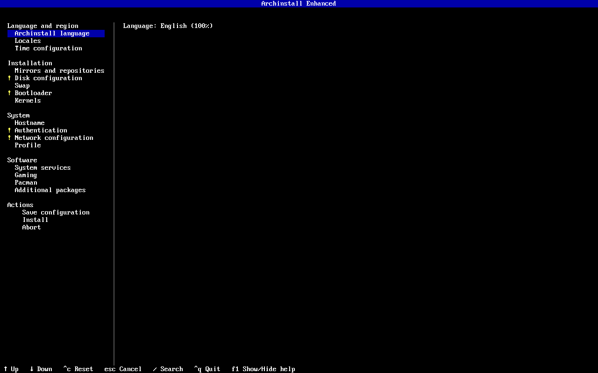
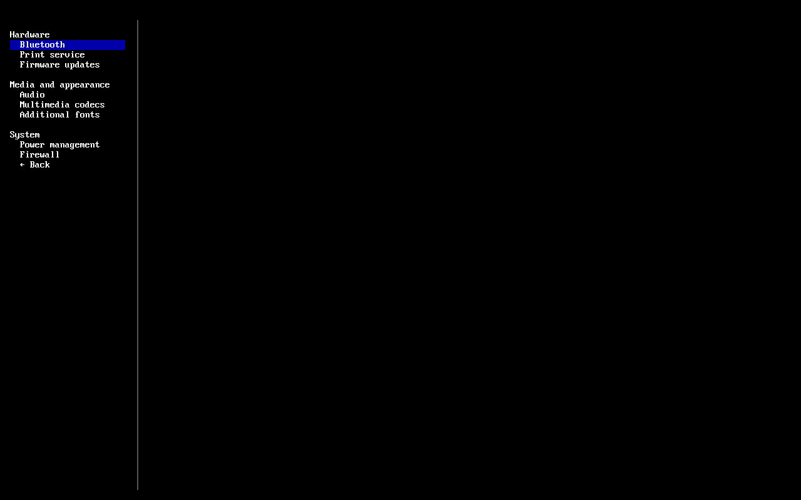
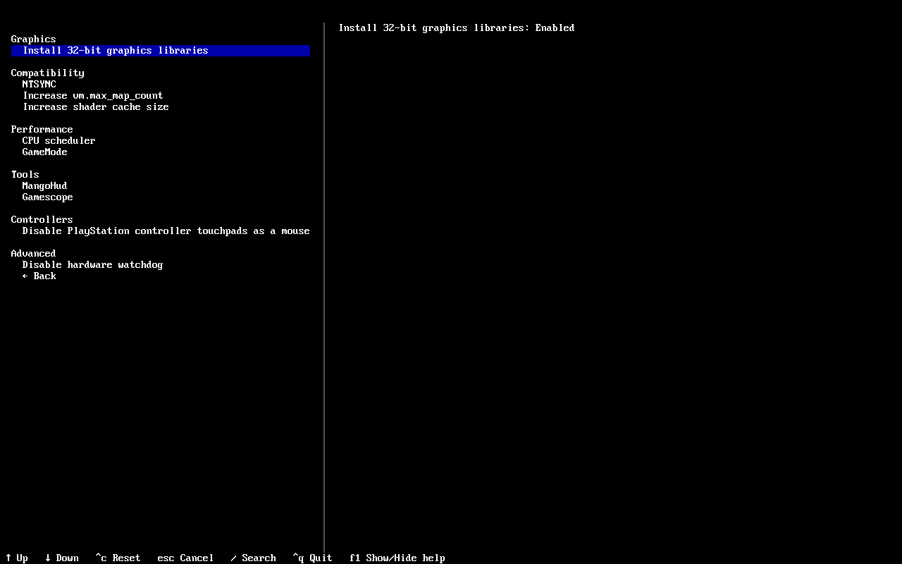
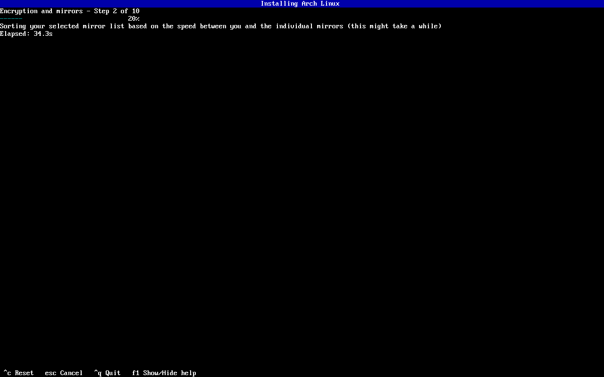

# Archinstall Enhanced

<p align="center">
  
</p>

<p align="center">
  A practical Arch Linux installer for complete desktop and gaming systems.
</p>

<p align="center">
  <a href="https://github.com/davgar99/archinstall-enhanced/actions/workflows/pytest.yaml"></a>
  <a href="https://github.com/davgar99/archinstall-enhanced/actions/workflows/ruff-lint.yaml"></a>
  <a href="LICENSE"></a>
</p>

Archinstall Enhanced builds on the official [Archinstall](https://github.com/archlinux/archinstall) guided installer. It keeps the familiar installation flow while adding the desktop integration, gaming support, hardware setup, and quality-of-life options that many users otherwise configure after their first boot.

The project favors documented, maintainable configuration over collections of unexplained tweaks. Hardware-specific, workload-specific, or experimental features remain optional.

> [!IMPORTANT]
> This is an independent fork. It is not an official Arch Linux project, and the `archinstall` package in the Arch repositories provides the upstream installer rather than this edition.

> [!CAUTION]
> An operating-system installer can erase disks. Review the installation summary and verify every target device before confirming changes. Test development builds in a virtual machine or on a disposable disk.

## Quick start

Boot an official [Arch Linux installation image](https://archlinux.org/download/), connect to the internet, and run:

```bash
pacman -Sy --needed git
git clone https://github.com/davgar99/archinstall-enhanced.git
cd archinstall-enhanced
python -m archinstall
```

The live image already runs as root, so these commands do not need `sudo`.

To update an existing clone:

```bash
git pull --ff-only
python -m archinstall
```

You can also install the project into the live environment:

```bash
pip install --break-system-packages .
archinstall
```

## What is enhanced

| Area | Additions in this fork |
|---|---|
| Installer experience | Grouped menus, consistent summaries and prompt ordering, clearer destructive-action review, improved activity and error feedback |
| Desktop foundation | Portals, codecs, hardware diagnostics, package-cache maintenance, Fontconfig defaults, common command-line utilities |
| Gaming | 32-bit graphics libraries, sched-ext, NTSYNC, GameMode, MangoHud, Gamescope, shader-cache and compatibility options |
| Hardware | Graphics-aware OpenCL, firmware updates, Bluetooth, printing, VirtualBox guest integration, controller and watchdog options |
| Storage and memory | Balanced zram profiles and Zstandard compression for automatically generated Btrfs layouts |
| Networking | NetworkManager DNS caching, mDNS-aware printer discovery, and automatic Wi-Fi regulatory configuration |
| Pacman | Parallel download controls, color output, `ILoveCandy`, and automatic package-cache cleanup for desktop profiles |

Most additions are choices in the guided installer. The desktop baseline includes only broadly useful integration and diagnostic packages; larger, specialized, or experimental components require an explicit selection.

## Guided installer

The main screen is divided into the same decisions users make while planning an installation:

- language, locale, and time
- mirrors and repositories
- disks, swap, bootloader, and kernels
- hostname, authentication, networking, and system profile
- system services, gaming options, Pacman settings, and additional packages
- configuration saving, review, and installation

Every section presents a consistent summary. Mandatory problems are identified before installation, and confirmation prompts begin with the safer choice selected.

<p align="center">
  
</p>

### System services

The **System services** menu brings common post-install decisions into one place:

- PipeWire or PulseAudio, with `rtkit` integration for PipeWire
- complete GStreamer and FFmpeg multimedia support
- Bluetooth
- CUPS printing and network-printer discovery
- firmware updates through `fwupd`
- `power-profiles-daemon` or TuneD power management
- firewalld or UFW
- optional Noto, emoji, CJK, Liberation, and DejaVu font families

The installer coordinates related features. For example, printer discovery adapts to the selected DNS resolver so mDNS is provided without conflicting resolver paths.

<p align="center">
  
</p>

### Gaming

The dedicated **Gaming** menu can configure:

- GPU-matched 32-bit OpenGL and Vulkan libraries for Steam, Wine, Proton, and older games
- sched-ext CPU schedulers, grouped by stable or experimental status
- NTSYNC autoloading for current Wine and Proton synchronization
- GameMode
- MangoHud
- Gamescope
- a 12 GiB Mesa and NVIDIA shader-cache limit
- the SteamOS `vm.max_map_count` value for memory-map-heavy games
- libinput rules that stop DualShock 4 and DualSense touchpads from moving the desktop pointer without hiding the controllers from games
- an advanced option to disable AMD or Intel hardware watchdog modules on affected systems

Multilib is enabled only when a selected option requires 32-bit packages. Compatibility and tuning choices include explanations and remain user-controlled.

<p align="center">
  
</p>

### Graphics and desktop integration

Graphics packages follow the driver chosen in the desktop profile. The installer can add:

- matching 32-bit Mesa, Vulkan, or NVIDIA libraries
- driver-appropriate OpenCL runtimes for compute workloads
- `mesa-utils`, `vulkan-tools`, and `libva-utils` for post-install verification
- desktop portals, including GTK fallback coverage and the wlroots screen-sharing backend for Sway
- a maintained Fontconfig preset that avoids poor bitmap fallbacks while preserving bitmap emoji

Modern Xorg modesetting is used for Nouveau rather than the legacy Nouveau DDX. OpenCL remains separate from gaming because most games do not require it.

When the installer positively detects a VirtualBox guest, it installs and enables the guest utilities and prepares configured users for shared-folder access. This does not run on physical machines, KVM, QEMU, or VMware guests.

### Storage and memory defaults

Swap-on-zram is enabled by default and can be disabled. When enabled, it uses:

- a virtual device sized to the smaller of installed RAM or 8 GiB
- Zstandard level 3 by default
- balanced parameters for tunable LZ4 and LZ4HC alternatives
- the ArchWiki-recommended virtual-memory values for prioritizing compressed RAM and reducing swap read-ahead

Automatically generated Btrfs layouts use transparent Zstandard compression by default. Compression and Copy-on-Write behavior remain configurable when a workload needs something different.

### Networking and DNS

NetworkManager installations can use either:

- `systemd-resolved`, the recommended default, through its local `127.0.0.53` caching stub
- NetworkManager's local `dnsmasq` integration with an expanded cache
- no local DNS cache

DNS caching can reduce repeated lookup latency, but it does not increase connection bandwidth.

#### Automatic Wi-Fi regulatory domains

On systems with Wi-Fi hardware, the installer adds `wireless-regdb` and `iw` and enables a small `AUTO` regulatory-domain service. Ethernet-only systems do not receive those packages solely for this feature.

`AUTO` is a mode implemented by Archinstall Enhanced. It is not a country code passed to the kernel. At boot and whenever `/etc/localtime` changes, the service:

1. reads the current IANA timezone from `timedatectl`
2. maps an unambiguous timezone to its ISO country code using `zone1970.tab`
3. applies that code with `iw reg set`

For example, `America/Chicago` maps to `US`, `Europe/Moscow` maps to `RU`, and `Asia/Shanghai` maps to `CN`. If the timezone is missing or spans multiple countries, the service makes no change and retains the conservative world regulatory domain.

This feature does not track location or contact a geolocation service. Travel updates occur when the desktop environment or another system component changes the system timezone. Users who prefer a fixed setting can replace `AUTO` in `/etc/conf.d/wireless-regdom` with a two-letter code such as `US`.

### Time and dual-boot behavior

Timezone, network time synchronization, and hardware-clock behavior are configured together. Enabling NTP activates both `systemd-timesyncd.service` and `systemd-time-wait-sync.service`.

When a Windows Boot Manager EFI entry is detected, the installer defaults away from writing the hardware clock as UTC to reduce common dual-boot clock conflicts. The user can override that choice.

### Pacman and maintenance

The guided Pacman menu exposes:

- 1 to 10 parallel downloads
- colored output
- `ILoveCandy`

Desktop profiles install `pacman-contrib` and enable the weekly `paccache.timer`. The normal policy keeps the three newest versions of cached packages, preserving useful downgrade options while limiting cache growth.

## Saved configurations

Archinstall Enhanced uses Archinstall's normal JSON configuration system. Fork-specific settings are saved alongside upstream settings and restored through the same interface.

Examples are available in:

- [`examples/config-sample.json`](examples/config-sample.json)
- [`examples/creds-sample.json`](examples/creds-sample.json)

Load a saved configuration with:

```bash
archinstall --config user_configuration.json --creds user_credentials.json
```

Credentials can use Archinstall's existing encryption support. Review saved configurations after major upstream or fork updates before using them for unattended installation.

## Project principles

Archinstall Enhanced aims to be opinionated enough to save time without taking control away from the user:

- stay close to upstream Archinstall
- prefer Arch Linux and upstream project documentation
- make specialized or experimental behavior opt-in
- explain meaningful compatibility and storage tradeoffs in the installer
- detect hardware before installing hardware-specific support
- avoid writing configuration into user home directories during installation
- add regression coverage for fork-specific behavior

Arch Linux documentation and upstream behavior take priority. Guidance from other Arch-based distributions may be used as a cross-check, but distribution-specific tuning is adopted only when it is suitable for a general Arch system.

The automatic upstream-sync workflow checks hourly. New upstream commits are merged with fork changes preserved, then the merged tree is tested in an isolated Arch Linux container before write credentials are introduced and the result is pushed.

## Development and testing

Install the project with its development dependencies, then run the relevant checks:

```bash
pip install --break-system-packages '.[dev]'
pytest
ruff check .
ruff format --check .
mypy .
bandit -c pyproject.toml -r archinstall
```

The repository also retains upstream build, documentation, translation, lint, ISO, and UKI workflows. Installation-critical changes should be tested in an Arch Linux environment and on disposable virtual hardware before use on a real disk.

The installation progress screen reports the current stage while the detailed log remains available for diagnosis.

<p align="center">
  
</p>

## Contributing

Read [`CONTRIBUTING.md`](CONTRIBUTING.md) before submitting a change. Fork-specific patches should have a focused purpose, preserve upstream compatibility where practical, include tests for behavioral changes, and cite supporting documentation for system-level defaults.

Bug reports caused by this fork belong in this repository. General Archinstall questions and upstream issues should use the official project resources.

## Resources

- [Archinstall documentation](https://archinstall.archlinux.page/)
- [Official Archinstall repository](https://github.com/archlinux/archinstall)
- [Arch Linux Wiki](https://wiki.archlinux.org/)
- [Arch Linux downloads](https://archlinux.org/download/)

## License

Archinstall Enhanced is distributed under the same [GNU General Public License v3.0](LICENSE) as upstream Archinstall.
